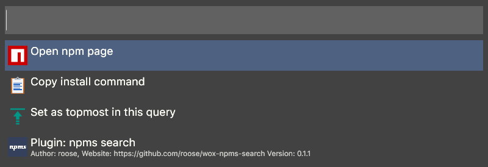

wox npm search
==================

[Wox](https://github.com/Wox-launcher/Wox)/[Flow Launcher](https://github.com/Flow-Launcher/Flow.Launcher) plugin to search for npm packages with [npms.io](https://npms.io)

## Installing

Download latest plugin(\*.wox/\*.flowlauncher file) from [releases](https://github.com/roose/wox-npms-search/releases) and drag and drop to Wox/Flow Launcher window

## Screenshot

### Context menu(<kbd>Shift</kbd>+<kbd>Enter</kbd>):

